# Remote Agent Artifact Handoff

Status: implemented locally in KimiBuilt and the user-owned `nuts` router; production promotion requires a lockstep release.

## Decision

The primary play is backend artifact orchestration, not frontend tool mirroring.

| Boundary | Owner | Responsibility |
|---|---|---|
| Session artifacts | KimiBuilt | authorize selected inputs, persist returned files, lineage, previews, downloads |
| Agent execution boundary | `nuts` | isolate and stage inputs, acknowledge the contract, collect and hash safe outputs |
| Agent implementation | Codex / Kimi CLI / Grok Build | read staged design context, edit/build/test/deploy, copy chosen deliverables into the isolated output area |
| Product UI | Web Chat (implemented); Canvas / Web CLI (planned thin mirrors) | Web Chat shows the Build with Agent / Push to Web job, progress, artifacts, and deployment proof; planned mirrors should reuse the same backend contract |
| Deployment truth | Git + image/build + k3s + HTTPS/browser proof | distinguish local artifact, source commit, image, rollout, and public site states |

The model router should not score or reinterpret artifact bytes. It supplies the secure file bridge next to the existing Codex and provider-agent execution routes. KimiBuilt remains the canonical artifact and workflow system.

## End-to-end flow

```mermaid
flowchart LR
  S["Sandbox / document / SVG artifact"] --> K["KimiBuilt session authorization + RemoteAgentHandoff/v1"]
  K --> N["nuts isolated staging + acknowledgement"]
  N --> A["Codex, Kimi CLI, or Grok Build"]
  A --> O["Run-scoped output/files + result manifest"]
  O --> V["nuts regular-file, path, size, and SHA-256 verification"]
  V --> P["KimiBuilt artifact persistence + lineage"]
  P --> D["Existing Push to Web / Git and k3s promotion"]
  D --> Q["HTTPS and browser proof"]
```



1. A sandbox, Canvas, document, XML, SVG, image, ZIP, or source artifact is selected in the active KimiBuilt session.
2. `remote-cli-agent` resolves those IDs only within that session, or accepts bounded inline `contextFiles`.
3. KimiBuilt creates a UUID-scoped contract under `.kimibuilt/agent-runs/<operationId>/` and calls the normal outer tool. OpenAI models use the Codex-agent route; Kimi/Grok models use the provider-agent route.
4. `nuts` validates bytes, size, checksum, exact paths, and reserved filenames. It stages locally for Codex or over strict host-key-checked SSH for Kimi/Grok's configured target, then returns an acknowledgment.
5. The selected CLI agent works normally. Files that should return must be copied to the run's `output/files/` directory and listed in `output/manifest.json`.
6. Once the run is terminal, KimiBuilt pulls the authenticated result endpoint. `nuts` rejects traversal, pre-existing paths outside the isolated directory, symlinks, non-regular files, invalid manifests, oversize files, and checksum failures.
7. KimiBuilt verifies the envelope, stores the files as `remote-cli-agent` artifacts, reloads the persisted bytes after privacy restoration, and runs the structural gate again before exposing an artifact or assembling a site. Invalid rewritten JSON/XML/SVG/HTML rolls back the entire result set. No base64 is returned to the browser. When the manifest explicitly marks one `index.html` as `site-entry` and its sibling site members as `site-file`, KimiBuilt assembles exactly those final validated bytes into one native ZIP `siteBundle` artifact.
8. The existing artifact-to-managed-app / Push to Web path promotes the chosen source bundle. The native bundle uses the entry directory as its archive root, so preview, Bundle Zip, and Push to Web all start at `index.html`. A public deployment is complete only after source/build/image, rollout, HTTPS, and visual proof are distinct and present.

The Web Chat **Build with Agent** action probes the authenticated async runtime before rendering a queued job. Explicit selected-agent jobs require the runtime and live-remote adapter to be enabled; the separate `webChatParallelEnabled` control only governs automatic shadow runs and is not an explicit-job prerequisite. When async execution is disabled or its status cannot be confirmed, the action preserves the selected artifact IDs and lineage and continues through the existing direct `remote-cli-agent` chat lane without first rendering a duplicate user message or failed async card. The explicit `/remote async ...` command remains an async-only diagnostic and does not silently change lanes.

Kimi K3 selection is explicit across the boundary. KimiBuilt maps `kimi-k3`, `Kimi K3`, `Kimi 3`, and bare `k3` selections to the router's authenticated `kimi-code-cli` provider with model `k3`; generic Kimi selections continue to use `kimi-for-coding`. The router exposes K3 without fallbacks and passes it to the installed CLI as the separate argv pair `--model k3`, while preserving the user's original model label in result metadata. The router must therefore be promoted before KimiBuilt.

## Deployment eligibility preflight

`POST /api/artifacts/:id/managed-app/preflight` runs the same ownership, archive, path, member, binary-asset, privacy-restoration, and final-byte preparation used by Push to Web without calling `createApp` or mutating a repository. Its response contains only deployment eligibility, typed blockers, target paths, byte counts, per-file SHA-256 values, and one aggregate source SHA-256; it never returns source content.

Deployment restoration deliberately differs from browser preview restoration. HTML text-node values are HTML-escaped and emitted without preview `<mark>` wrappers. Any unresolved reserved placeholder fails closed even when the global PII policy is disabled, and protected values are not restored into non-HTML structured or executable members such as CSS, XML, SVG, JSON, or JavaScript because their exact grammar context is ambiguous. Artifacts or site components that were already raw-restored before that context was known are also blocked from public promotion. A later `POST /api/artifacts/:id/managed-app` may include `expectedSourceSha256`; a malformed value returns HTTP 400 and a changed final-byte fingerprint returns HTTP 412 before any app is created or changed. Successful mutations attest the accepted source hash and byte count.

The Web Chat **Push to Web** control is the thin frontend mirror for this gate: it runs preflight before asking for a hostname, surfaces the first typed blocker without starting a deployment, and submits the returned `sha256` as `expectedSourceSha256` with the mutation. This makes the source-change guard active for the real user path, not only for diagnostics.

## Three-agent transfer and authoring canaries

`npm run canary:remote-agent-artifact-loop` is a zero-network dry run by default. It validates both hops for Codex, Kimi, and Grok and reports `networkRequestsMade: 0`. A live run requires an explicit `--run`, `KIMIBUILT_CANARY_BASE_URL`, and the existing `KIMIBUILT_FRONTEND_API_KEY`:

```bash
npm run canary:remote-agent-artifact-loop -- --mode all
npm run canary:remote-agent-artifact-loop -- --run --mode all
npm run canary:remote-agent-authoring -- --mode all
npm run canary:remote-agent-authoring -- --run --mode all
npm run canary:remote-agent-authoring -- --run --mode all --browser-qa
```

For each lane, hop one sends deterministic HTML, CSS, XML, and SVG fixtures to the selected CLI and verifies persisted component downloads, a role-built site ZIP, and a semantic preview. Hop two sends the four returned artifact IDs back through the same KimiBuilt session and repeats the byte proof, then runs the side-effect-free managed-app preflight against the final site bundle. Live mode requires explicit remote-execution evidence, verifies both the requested label and the resolved provider model (`k3` for Kimi K3), never sends an inner CLI continuation session ID, and deletes the ephemeral session only after every run is terminal. No production live canary has been run yet.

The transfer canary proves that supplied bytes survive both directions; it does not claim that an agent can originate a good design. The explicit `--authoring` scenario runs only after both transfer hops for each selected lane. It supplies no input artifacts or context files and asks the non-admin Codex, Kimi, or Grok CLI lane to author an original four-file static site: `index.html`, `styles.css`, `design/design.xml`, and `design/design.svg`, with one `site-entry` and three `site-file` roles. KimiBuilt then checks exact Codex transport/requested-model identity, exact Kimi/Grok provider and resolved-model identity, descriptor and downloaded-byte SHA/size agreement, the local `validateResultArtifactSet` structural gate, accessible and responsive brief markers, exact ZIP membership and bytes, preview equality, and bundle-bound managed-app preflight. This is still validation only and never calls the managed-app mutation or deploys the result.

`--browser-qa` is optional and valid only with `--authoring`. In a live run it executes `bin/kimibuilt-ui-check.js` against the canonical authenticated artifact preview before the ephemeral session is deleted, requires clean desktop and mobile reports, blocks and reports every outside-origin HTTP request, and passes the existing API credential only through the inherited environment rather than command-line arguments. A dry run with either flag still makes zero HTTP requests, starts no agent, and starts no browser. No live transfer or authoring canary has been run against production yet.

## Contract limits and security properties

- Versions: `RemoteAgentHandoff/v1` and `RemoteAgentResultFiles/v1`.
- Maximum 12 files, 4 MiB per file, 6 MiB decoded total in each direction.
- Input `manifest.json` is gateway-owned and cannot be supplied as a context filename.
- `.kimibuilt/agent-runs/<operationId>/` is gateway scratch space and must never be added to Git, committed, published, or deployed.
- Returned-file collection requires an active KimiBuilt session before any remote run starts.
- Uploaded artifacts suppressed by the active PII/privacy policy cannot be exported to a remote CLI provider.
- Caller-selected global directories are not supported; paths must exactly match the operation UUID.
- A read-only run without inputs or returned-file collection creates no handoff.
- The MCP compatibility lane rejects handoffs.
- The router start response, not the request, proves acceptance.
- Result paths are authoritative only after the authenticated router endpoint verifies them.
- The v1 JSON/base64 envelope is intentionally small. Larger design bundles should move to short-lived, checksum-bound object-store URLs in a later version.
- Nested returned paths are retained as lineage metadata and converted to deterministic collision-free artifact filenames, so duplicate basenames can safely make a second handoff. For a complete website, all site members must share the `site-entry` directory; exactly one `index.html` uses `site-entry`, every bundled sibling uses `site-file`, and QA or unrelated deliverables use other roles. Ambiguous site roles fail before writes, while a later storage or serialization failure rolls back the entire result envelope.
- Native role-marked site assembly remains within the v1 byte/file limits and does not change the router contract because `role` is already gateway-preserved metadata. Larger bundles still require the future checksum-bound object-store lane.
- The current managed-app repository writer is text-only. Push to Web preserves every safe valid UTF-8 archive member regardless of extension, but returns HTTP 422 with `ARTIFACT_MANAGED_APP_UNSUPPORTED_BINARY_ASSETS` when a native bundle contains PNG/JPEG/WebP, fonts, media, opaque binary files, or another binary payload. Malformed ZIPs, unsafe paths, and entry/count/member declaration mismatches return `ARTIFACT_MANAGED_APP_INVALID_SITE_BUNDLE`; `previewHtml` never replaces or rescues an explicit archive. The route must never silently omit files and deploy a broken site; replace binary assets with text-safe assets or add binary repository support first.

## Release gate

KimiBuilt and `nuts` must be promoted together. Deploying only KimiBuilt would send a contract the old router ignores; deploying only `nuts` is compatible but unused.

Before production promotion:

1. Commit and push both repositories.
2. Build immutable images from those exact commits.
3. Audit the live `remote-cli-tail-hotfix` ConfigMap, which currently shadows `/app/dist/jobs/remote-cli-tool-manager.js`; remove or update it so the image remains the source of truth.
4. Reconcile the checked-in router image pins with the live image rather than applying stale manifests.
5. Roll out the router first, prove health/auth and handoff capability, then roll out KimiBuilt.
6. Run `npm run canary:remote-agent-artifact-loop -- --run --mode all` with an authorized frontend API key. Require both byte-identical hops and a passing managed-app preflight for Codex, Kimi K3, and Grok.
7. Run `npm run canary:remote-agent-authoring -- --run --mode all --browser-qa`. Require original output-only HTML/CSS/XML/SVG authoring, exact lane identity, exact returned bytes and paths, a bundle-bound preview/preflight, and two clean browser viewports for all three lanes.
8. Run the existing Push to Web flow from the returned artifact and verify the public URL with desktop/mobile browser evidence.
