# Remote Agent Artifact Handoff

Status: implemented and promoted in KimiBuilt and the user-owned `nuts` router. The active delivery scope is Codex plus Kimi; Grok compatibility is not a release gate.

## Decision

The primary play is backend artifact orchestration, not frontend tool mirroring.

| Boundary | Owner | Responsibility |
|---|---|---|
| Session artifacts | KimiBuilt | authorize selected inputs, persist returned files, lineage, previews, downloads |
| Agent execution boundary | `nuts` | isolate and stage inputs, acknowledge the contract, collect and hash safe outputs |
| Agent implementation | Codex / Kimi CLI | read staged design context, edit/build/test/deploy, copy chosen deliverables into the isolated output area |
| Product UI | Web Chat and Web CLI (implemented build/deploy mirrors); Canvas and Notes (implemented continuation mirrors) | Web Chat and Web CLI select persisted artifacts, launch the shared remote-agent contract, show returned files, run managed-app preflight, and submit SHA-bound Push to Web requests. Canvas and Notes attach an owned artifact into their own scoped session and pass only the destination artifact ID to their native agent route. |
| Deployment truth | Git + image/build + k3s + HTTPS/browser proof | distinguish local artifact, source commit, image, rollout, and public site states |

The model router should not score or reinterpret artifact bytes. It supplies the secure file bridge next to the existing Codex and provider-agent execution routes. KimiBuilt remains the canonical artifact and workflow system.

## End-to-end flow

```mermaid
flowchart LR
  S["Sandbox / document / SVG artifact"] --> K["KimiBuilt session authorization + RemoteAgentHandoff/v1"]
  K --> N["nuts isolated staging + acknowledgement"]
  N --> A["Codex or Kimi CLI"]
  A --> O["Run-scoped output/files + result manifest"]
  O --> V["nuts regular-file, path, size, and SHA-256 verification"]
  V --> P["KimiBuilt artifact persistence + lineage"]
  P --> D["Existing Push to Web / Git and k3s promotion"]
  D --> Q["HTTPS and browser proof"]
```



1. A sandbox, Canvas, document, XML, SVG, image, ZIP, or source artifact is selected in the active KimiBuilt session.
2. `remote-cli-agent` resolves those IDs only within that session, or accepts bounded inline `contextFiles`.
3. KimiBuilt creates a UUID-scoped contract under `.kimibuilt/agent-runs/<operationId>/` and calls the normal outer tool. OpenAI models use the Codex-agent route; Kimi models use the provider-agent route.
4. `nuts` validates bytes, size, checksum, exact paths, and reserved filenames. It stages locally for Codex or over strict host-key-checked SSH for Kimi's configured target, then returns an acknowledgment.
5. The selected CLI agent works normally. Files that should return must be copied to the run's `output/files/` directory and listed in `output/manifest.json`.
6. Once the run is terminal, KimiBuilt pulls the authenticated result endpoint. `nuts` rejects traversal, pre-existing paths outside the isolated directory, symlinks, non-regular files, invalid manifests, oversize files, and checksum failures.
7. KimiBuilt verifies the envelope, stores the files as `remote-cli-agent` artifacts, reloads the persisted bytes after privacy restoration, and runs the structural gate again before exposing an artifact or assembling a site. Invalid rewritten JSON/XML/SVG/HTML rolls back the entire result set. No base64 is returned to the browser. When the manifest explicitly marks one `index.html` as `site-entry` and its sibling site members as `site-file`, KimiBuilt assembles exactly those final validated bytes into one native ZIP `siteBundle` artifact.
8. The existing artifact-to-managed-app / Push to Web path promotes the chosen source bundle. The native bundle uses the entry directory as its archive root, so preview, Bundle Zip, and Push to Web all start at `index.html`. A successful build webhook must attest a canonical OCI `sha256:` digest before deployment can start; KimiBuilt deploys the digest-pinned image and keeps the requested tag separate as non-authoritative metadata. A public deployment is complete only after source, build, image digest, rollout, HTTPS, and visual proof are distinct and agree.

The Web Chat **Build with Agent** action probes the authenticated async runtime before rendering a queued job. Explicit selected-agent jobs require the runtime and live-remote adapter to be enabled; the separate `webChatParallelEnabled` control only governs automatic shadow runs and is not an explicit-job prerequisite. When async execution is disabled or its status cannot be confirmed, the action preserves the selected artifact IDs and lineage and continues through the existing direct `remote-cli-agent` chat lane without first rendering a duplicate user message or failed async card. The explicit `/remote async ...` command remains an async-only diagnostic and does not silently change lanes.

The Web CLI file manager is a second build/deploy mirror. **Use with Agent** records stable persisted artifact IDs for the next `/remote agent` request, and the result view distinguishes IDs explicitly returned by the agent from files that merely appeared in the session during the run. **Push to Web** runs preflight before asking for a host and submits the accepted source SHA-256 with the mutation. The current control reports that deployment was queued; it does not itself prove rollout completion or public HTTPS/browser health.

Canvas and Notes are continuation mirrors, not copies of the complete remote-tool palette. Opening a returned artifact through its lineage URL calls `POST /api/artifacts/:id/attach`, copies the exact owned bytes into the destination surface's owner-scoped session, preserves source ID/checksum lineage, and sends only the attached destination ID with later native-agent requests. Neither surface currently launches `remote-cli-agent` or Push to Web directly, and neither automatically changes the board/page when the link opens.

XML and SVG remain exact downloadable/agent-context inputs in Canvas and Notes, but they are deliberately reported as `context-only` with `browserImportAllowed:false`. There is no honest editable XML/SVG importer in either surface yet. This preserves the source bytes without claiming that a Canvas board or Notes page is a lossless editable representation of those formats.

Kimi K3 selection is explicit across the boundary. KimiBuilt maps `kimi-k3`, `Kimi K3`, `Kimi 3`, and bare `k3` selections to the router's authenticated `kimi-code-cli` provider with model `k3`; generic Kimi selections continue to use `kimi-for-coding`. The router exposes K3 without fallbacks and passes it to the installed CLI as the separate argv pair `--model k3`, while preserving the user's original model label in result metadata. The router must therefore be promoted before KimiBuilt.

## Deployment eligibility preflight

`POST /api/artifacts/:id/managed-app/preflight` runs the same ownership, archive, path, member, binary-asset, privacy-restoration, and final-byte preparation used by Push to Web without calling `createApp` or mutating a repository. It also authenticates to the configured repository control plane and verifies access to the managed-app organization. Its response contains only deployment eligibility, safe repository-readiness facts, typed blockers, target paths, byte counts, per-file SHA-256 values, and one aggregate source SHA-256; it never returns source content or credentials. `GET /api/managed-apps/readiness` exposes the same non-mutating repository gate before an artifact exists.

Deployment restoration deliberately differs from browser preview restoration. HTML text-node values are HTML-escaped and emitted without preview `<mark>` wrappers. Any unresolved reserved placeholder fails closed even when the global PII policy is disabled, and protected values are not restored into non-HTML structured or executable members such as CSS, XML, SVG, JSON, or JavaScript because their exact grammar context is ambiguous. Artifacts or site components that were already raw-restored before that context was known are also blocked from public promotion. A later `POST /api/artifacts/:id/managed-app` may include `expectedSourceSha256`; a malformed value returns HTTP 400 and a changed final-byte fingerprint returns HTTP 412 before any app is created or changed. Successful mutations attest the accepted source hash and byte count.

The Web Chat and Web CLI **Push to Web** controls are thin frontend mirrors for this gate: each runs preflight before asking for a hostname, surfaces the first typed blocker without starting a deployment, and submits the returned `sha256` as `expectedSourceSha256` with the mutation. This makes the source-change guard active for the real user path, not only for diagnostics.

The later build/deploy chain is fail-closed and webhook-driven. For this ARM64 k3s release, the generated GitLab pipeline defaults to a single `linux/arm64` image, pushes the commit tag, resolves its canonical registry digest, and includes that digest with the commit and pipeline identity in the authenticated build event. A successful event without a canonical digest is rejected. Deployment binds the requested build run, commit, and digest, applies `imageRepo@sha256:...`, and separately inspects the Deployment image, newest pod image, and runtime `imageID`. The requested tag is retained only for traceability. Rollout and public HTTPS do not become final deployment proof unless the build-attested digest and observed pod digest agree.

## Codex and Kimi transfer and authoring canaries

`npm run canary:remote-agent-artifact-loop` is a zero-network dry run by default. The active delivery gate validates both hops for Codex and Kimi and reports `networkRequestsMade: 0`. A live run requires an explicit `--run`, `KIMIBUILT_CANARY_BASE_URL`, and the existing `KIMIBUILT_FRONTEND_API_KEY`. The canary still accepts a Grok mode for compatibility, but Grok is not part of this release scope:

```bash
npm run canary:remote-agent-artifact-loop -- --mode codex
npm run canary:remote-agent-artifact-loop -- --mode kimi
npm run canary:remote-agent-artifact-loop -- --run --mode codex
npm run canary:remote-agent-artifact-loop -- --run --mode kimi
npm run canary:remote-agent-authoring -- --run --mode codex --browser-qa
npm run canary:remote-agent-authoring -- --run --mode kimi --browser-qa
```

For each lane, hop one sends deterministic HTML, CSS, XML, and SVG fixtures to the selected CLI and verifies persisted component downloads, a role-built site ZIP, and a semantic preview. Hop two sends the four returned artifact IDs back through the same KimiBuilt session and repeats the byte proof, then runs the side-effect-free managed-app preflight against the final site bundle. Live mode requires explicit remote-execution evidence, verifies both the requested label and the resolved provider model (`k3` for Kimi K3), never sends an inner CLI continuation session ID, and deletes the ephemeral session only after every run is terminal. Production transfer proof on 2026-07-18 passed both Codex and Kimi exact-byte round trips.

The transfer canary proves that supplied bytes survive both directions; it does not claim that an agent can originate a good design. The explicit `--authoring` scenario runs only after both transfer hops for each selected lane. It supplies no input artifacts or context files and asks the non-admin Codex or Kimi CLI lane to author an original four-file static site: `index.html`, `styles.css`, `design/design.xml`, and `design/design.svg`, with one `site-entry` and three `site-file` roles. KimiBuilt then checks exact Codex transport/requested-model identity, exact Kimi provider and resolved-model identity, descriptor and downloaded-byte SHA/size agreement, the local `validateResultArtifactSet` structural gate, accessible and responsive brief markers, exact ZIP membership and bytes, preview equality, and bundle-bound managed-app preflight. This is still validation only and never calls the managed-app mutation or deploys the result. Production Codex authoring passed this complete contract plus two-viewport browser QA on 2026-07-18; the corresponding Kimi rerun is externally blocked by its billing-cycle quota.

`--browser-qa` is optional and valid only with `--authoring`. In a live run it executes `bin/kimibuilt-ui-check.js` against the canonical authenticated artifact preview before the ephemeral session is deleted, requires clean desktop and mobile reports, blocks and reports every outside-origin HTTP request, and passes the existing API credential only through the inherited environment rather than command-line arguments. A dry run with either flag still makes zero HTTP requests, starts no agent, and starts no browser.

### Sandbox-origin and cross-session attachment canary

`npm run canary:sandbox-agent-attach` also defaults to a zero-network plan check. Its live mode uses the real `code-sandbox` project path to create one deterministic HTML/CSS/XML/SVG project ZIP in an explicit source session, verifies that `/download` and `/bundle` return the same exact ZIP, and sends that persisted artifact through one selected Codex or Kimi K3 lane. Each returned ZIP is then attached into distinct owner-scoped Canvas and Notes sessions. A selected lane therefore performs three terminal-gated runs: sandbox origin, Canvas continuation, and Notes continuation. Run the canary once per delivery lane:

```bash
npm run canary:sandbox-agent-attach -- --mode codex
npm run canary:sandbox-agent-attach -- --mode kimi
npm run canary:sandbox-agent-attach -- --run --mode codex
npm run canary:sandbox-agent-attach -- --run --mode kimi
```

Live mode requires `KIMIBUILT_CANARY_BASE_URL` and `KIMIBUILT_FRONTEND_API_KEY`, confirms the async runtime allows live remote execution, proves that the workspace preview serves the original project entry, proves exact bytes and source lineage after every hop, and exercises typed failures for a wrong target session or surface. It deletes its three ephemeral sessions only after every accepted run is terminal and trackable; otherwise it retains them for diagnosis. Session-bound project artifacts carry an exact normalized sandbox workspace ID, and successful cleanup must prove that the formerly available preview returns 404 after the source session is deleted. This is API-level continuity proof. It does not claim that the served Canvas or Notes page imported XML/SVG into an editable native representation.

During a live run, the sandbox canary writes `SandboxAgentAttachProgress/v1` JSON Lines to stderr and reserves stdout for the final result document. It emits bounded phase, run, event-cursor, attachment, and cleanup facts when they change and on a default 15-second heartbeat cadence between successful polls while a run is otherwise quiet; `KIMIBUILT_CANARY_PROGRESS_INTERVAL_MS` can set a 5–60 second interval. Progress entries never include API credentials, prompts, response/event payloads, file contents, or model output.

### Explicit Push-to-Web canary

The authoring canary has an optional mutating continuation:

```bash
npm run canary:remote-agent-authoring -- --run --mode codex --browser-qa --push-to-web
npm run canary:remote-agent-authoring -- --run --mode kimi --browser-qa --push-to-web
```

It is intentionally unavailable to the PR workflow and refuses to start unless `ALLOW_PROD_WRITE=yes`, `HUMAN_APPROVED=yes`, a valid `CHANGE_TICKET`, and exactly matching `KIMIBUILT_CANARY_PUSH_TO_WEB_HOST_TEMPLATE` / `KIMIBUILT_CANARY_APPROVED_HOST_TEMPLATE` values are present. The lowercase host template must contain exactly one `{lane}` token. Before it creates an ephemeral session or starts any CLI agent, it calls `GET /api/managed-apps/readiness` and requires Postgres persistence, repository authentication, and managed-app organization access. For every lane, the canary then submits the exact artifact preflight SHA-256, requires the accepted response to declare the digest-required `build-webhook` lifecycle, and rejects any premature async deploy before the build completes. It polls managed-app progress to a terminal state, binds source/build/commit/pipeline evidence, requires one canonical build and observed OCI digest, and runs credential-free browser QA only at the approved HTTPS origin. Remote-agent cleanup still cancels and proves any active agent run terminal before deleting its session; the later webhook-driven deployment is observed through managed-app progress rather than represented as a cancellable async-lab run. This path is implemented and unit-tested; the 2026-07-18 production attempt was stopped before mutation because the configured GitLab credential returned HTTP 401.

### Current proof boundary

The PR workflow syntax-checks the handoff, frontend mirrors, managed-app build/deploy chain, and both canaries; runs their focused tests; and executes both zero-network dry-run plans. That is deterministic contract coverage, not a live end-to-end result. The sandbox canary now automates a real project-mode `code-sandbox` source, a selected Codex or Kimi CLI lane, cross-session `POST /api/artifacts/:id/attach`, and destination-ID reuse through Canvas and Notes API sessions. The approval-gated Push-to-Web continuation can automate managed-app mutation through terminal digest/rollout/HTTPS/browser evidence when an operator deliberately enables it.

The router and KimiBuilt lockstep rollout, exact Codex/Kimi transfer proof, Codex authoring/browser proof, and the Codex sandbox-origin/Canvas/Notes API continuity run were completed in production on 2026-07-18. The deployed `sha-db040d5` sandbox canary then streamed `SandboxAgentAttachProgress/v1` heartbeats through all three Codex runs and passed with one exact 2,961-byte ZIP (`c59ee783de8d172147142a9e02547b7c5a793e0ebc8233823b44f9de6317da9e`) across sandbox origin, Canvas, and Notes. Its final cleanup proof reported three deleted ephemeral sessions, one deleted sandbox workspace, and no retained session or workspace IDs; the former artifact, preview route, and workspace path all returned absent after cleanup. Grok is explicitly excluded from the delivery scope and acceptance criteria. The remaining release proofs are served-surface interaction through Canvas, Notes, and Web CLI, one successful Push-to-Web run against an authorized disposable host after GitLab authentication is repaired, and Kimi authoring after its provider capacity is available. A green PR, dry run, mocked canary test, queued deployment, or passing preflight must not be described as a live deployment.

## Contract limits and security properties

- Versions: `RemoteAgentHandoff/v1` and `RemoteAgentResultFiles/v1`.
- Maximum 12 files, 4 MiB per file, 6 MiB decoded total in each direction.
- Input `manifest.json` is gateway-owned and cannot be supplied as a context filename.
- `.kimibuilt/agent-runs/<operationId>/` is gateway scratch space and must never be added to Git, committed, published, or deployed.
- Returned-file collection requires an active KimiBuilt session before any remote run starts.
- Uploaded artifacts suppressed by the active PII/privacy policy cannot be exported to a remote CLI provider.
- Caller-selected global directories are not supported; paths must exactly match the operation UUID.
- A read-only run without inputs or returned-file collection creates no handoff.
- The MCP compatibility lane rejects handoffs.
- The router start response, not the request, proves acceptance.
- Result paths are authoritative only after the authenticated router endpoint verifies them.
- The v1 JSON/base64 envelope is intentionally small. Larger design bundles should move to short-lived, checksum-bound object-store URLs in a later version.
- Nested returned paths are retained as lineage metadata and converted to deterministic collision-free artifact filenames, so duplicate basenames can safely make a second handoff. For a complete website, all site members must share the `site-entry` directory; exactly one `index.html` uses `site-entry`, every bundled sibling uses `site-file`, and QA or unrelated deliverables use other roles. Ambiguous site roles fail before writes, while a later storage or serialization failure rolls back the entire result envelope.
- Native role-marked site assembly remains within the v1 byte/file limits and does not change the router contract because `role` is already gateway-preserved metadata. Larger bundles still require the future checksum-bound object-store lane.
- Managed-app digest equality currently assumes the generated single-platform `linux/arm64` build and the ARM64 production cluster. Restoring multi-platform output requires the build webhook to attest the OCI index and its platform-manifest relationship; an index digest must not be compared directly with an unproven child manifest digest.
- The current managed-app repository writer is text-only. Push to Web preserves every safe valid UTF-8 archive member regardless of extension, but returns HTTP 422 with `ARTIFACT_MANAGED_APP_UNSUPPORTED_BINARY_ASSETS` when a native bundle contains PNG/JPEG/WebP, fonts, media, opaque binary files, or another binary payload. Malformed ZIPs, unsafe paths, and entry/count/member declaration mismatches return `ARTIFACT_MANAGED_APP_INVALID_SITE_BUNDLE`; `previewHtml` never replaces or rescues an explicit archive. The route must never silently omit files and deploy a broken site; replace binary assets with text-safe assets or add binary repository support first.

## Release gate

KimiBuilt and `nuts` must be promoted together. Deploying only KimiBuilt would send a contract the old router ignores; deploying only `nuts` is compatible but unused.

Before production promotion:

1. Commit and push both repositories.
2. Build immutable images from those exact commits.
3. Audit the live `remote-cli-tail-hotfix` ConfigMap, which currently shadows `/app/dist/jobs/remote-cli-tool-manager.js`; remove or update it so the image remains the source of truth.
4. Reconcile the checked-in router image pins with the live image rather than applying stale manifests.
5. Roll out the router first, prove health/auth and handoff capability, then roll out KimiBuilt.
6. Run `npm run canary:remote-agent-artifact-loop -- --run --mode codex` and `--mode kimi` with an authorized frontend API key. Require both byte-identical hops and a passing managed-app preflight for Codex and Kimi K3.
7. Run `npm run canary:remote-agent-authoring -- --run --mode codex --browser-qa` and `--mode kimi --browser-qa`. Require original output-only HTML/CSS/XML/SVG authoring, exact lane identity, exact returned bytes and paths, a bundle-bound preview/preflight, and two clean browser viewports for both lanes.
8. Run `npm run canary:sandbox-agent-attach -- --run --mode codex` and `--mode kimi`. Require the real served sandbox preview and ZIP, all three non-admin runs per lane, both typed attachment failures, exact destination checksums, terminal-gated session cleanup, and a 404 proof for each exact artifact-linked sandbox workspace after cleanup.
9. Open a returned artifact in the served Canvas and Notes routes and prove the owner-scoped destination attachment, exact checksum, and destination artifact ID used by the next native-agent request.
10. Run the served Web CLI selection and returned-file flow, then use Push to Web from the verified site bundle.
11. On explicitly approved disposable hosts, run `npm run canary:remote-agent-authoring -- --run --mode codex --browser-qa --push-to-web` and the corresponding `--mode kimi` command with the write, human-approval, change-ticket, and exact host-template gates set.
12. Require the managed-app source/build/commit/pipeline chain, build-attested OCI digest, digest-pinned Deployment, matching pod `imageID`, rollout, public HTTPS, and desktop/mobile browser evidence to reach terminal success. A queued `202` response is not deployment completion.
