# Remote Agent Artifact Handoff

Status: implemented locally in KimiBuilt and the user-owned `nuts` router; production promotion requires a lockstep release.

## Decision

The primary play is backend artifact orchestration, not frontend tool mirroring.

| Boundary | Owner | Responsibility |
|---|---|---|
| Session artifacts | KimiBuilt | authorize selected inputs, persist returned files, lineage, previews, downloads |
| Agent execution boundary | `nuts` | isolate and stage inputs, acknowledge the contract, collect and hash safe outputs |
| Agent implementation | Codex / Kimi CLI / Grok Build | read staged design context, edit/build/test/deploy, copy chosen deliverables into the isolated output area |
| Product UI | Web Chat / Canvas / Web CLI | show one Build with Agent / Push to Web job, progress, artifacts, deployment proof |
| Deployment truth | Git + image/build + k3s + HTTPS/browser proof | distinguish local artifact, source commit, image, rollout, and public site states |

The model router should not score or reinterpret artifact bytes. It supplies the secure file bridge next to the existing Codex and provider-agent execution routes. KimiBuilt remains the canonical artifact and workflow system.

## End-to-end flow

```mermaid
flowchart LR
  S["Sandbox / document / SVG artifact"] --> K["KimiBuilt session authorization + RemoteAgentHandoff/v1"]
  K --> N["nuts isolated staging + acknowledgement"]
  N --> A["Codex, Kimi CLI, or Grok Build"]
  A --> O["Run-scoped output/files + result manifest"]
  O --> V["nuts regular-file, path, size, and SHA-256 verification"]
  V --> P["KimiBuilt artifact persistence + lineage"]
  P --> D["Existing Push to Web / Git and k3s promotion"]
  D --> Q["HTTPS and browser proof"]
```

1. A sandbox, Canvas, document, XML, SVG, image, ZIP, or source artifact is selected in the active KimiBuilt session.
2. `remote-cli-agent` resolves those IDs only within that session, or accepts bounded inline `contextFiles`.
3. KimiBuilt creates a UUID-scoped contract under `.kimibuilt/agent-runs/<operationId>/` and calls the normal outer tool. OpenAI models use the Codex-agent route; Kimi/Grok models use the provider-agent route.
4. `nuts` validates bytes, size, checksum, exact paths, and reserved filenames. It stages locally for Codex or over strict host-key-checked SSH for Kimi/Grok's configured target, then returns an acknowledgment.
5. The selected CLI agent works normally. Files that should return must be copied to the run's `output/files/` directory and listed in `output/manifest.json`.
6. Once the run is terminal, KimiBuilt pulls the authenticated result endpoint. `nuts` rejects traversal, pre-existing paths outside the isolated directory, symlinks, non-regular files, invalid manifests, oversize files, and checksum failures.
7. KimiBuilt verifies the envelope again and stores the files as `remote-cli-agent` artifacts with input artifact IDs plus transport/workspace/run lineage. No base64 is returned to the browser.
8. The existing artifact-to-managed-app / Push to Web path promotes the chosen source bundle. A public deployment is complete only after source/build/image, rollout, HTTPS, and visual proof are distinct and present.

## Contract limits and security properties

- Versions: `RemoteAgentHandoff/v1` and `RemoteAgentResultFiles/v1`.
- Maximum 12 files, 4 MiB per file, 6 MiB decoded total in each direction.
- Input `manifest.json` is gateway-owned and cannot be supplied as a context filename.
- `.kimibuilt/agent-runs/<operationId>/` is gateway scratch space and must never be added to Git, committed, published, or deployed.
- Returned-file collection requires an active KimiBuilt session before any remote run starts.
- Uploaded artifacts suppressed by the active PII/privacy policy cannot be exported to a remote CLI provider.
- Caller-selected global directories are not supported; paths must exactly match the operation UUID.
- A read-only run without inputs or returned-file collection creates no handoff.
- The MCP compatibility lane rejects handoffs.
- The router start response, not the request, proves acceptance.
- Result paths are authoritative only after the authenticated router endpoint verifies them.
- The v1 JSON/base64 envelope is intentionally small. Larger design bundles should move to short-lived, checksum-bound object-store URLs in a later version.
- Nested returned paths are retained as lineage metadata and converted to deterministic collision-free artifact filenames, so duplicate basenames can safely make a second handoff. Reconstructing several returned website files into one native KimiBuilt `siteBundle` remains a follow-up; v1 callers should return an explicit ZIP when directory-level preview or promotion is required.

## Release gate

KimiBuilt and `nuts` must be promoted together. Deploying only KimiBuilt would send a contract the old router ignores; deploying only `nuts` is compatible but unused.

Before production promotion:

1. Commit and push both repositories.
2. Build immutable images from those exact commits.
3. Audit the live `remote-cli-tail-hotfix` ConfigMap, which currently shadows `/app/dist/jobs/remote-cli-tool-manager.js`; remove or update it so the image remains the source of truth.
4. Reconcile the checked-in router image pins with the live image rather than applying stale manifests.
5. Roll out the router first, prove health/auth and handoff capability, then roll out KimiBuilt.
6. Run a live canary for each lane: Codex on the primary workspace, Kimi on the secondary target, and Grok on the secondary target. Use a harmless XML/SVG input and require a byte-identical returned artifact.
7. Run the existing Push to Web flow from the returned artifact and verify the public URL with desktop/mobile browser evidence.
